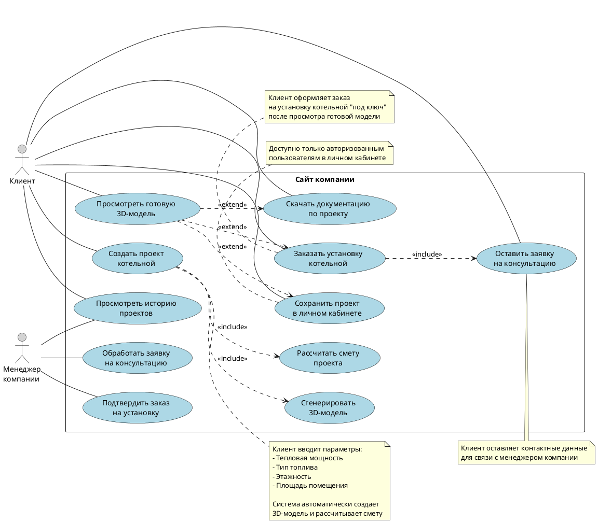

# Архитектура запроса

Диаграмма раскрывает как происходит создание заказа на установку котельной

```plantuml
@startuml
left to right direction
skinparam packageStyle rectangle
skinparam usecaseBorderColor Black
skinparam usecaseBackgroundColor LightBlue
skinparam actorBorderColor Black
skinparam actorBackgroundColor LightGray

actor "Клиент" as Client
actor "Менеджер\nкомпании" as Manager

rectangle "Сайт компании" {
usecase "Оставить заявку\nна консультацию" as UC1
usecase "Создать проект\nкотельной" as UC2
usecase "Просмотреть готовую\n3D-модель" as UC3
usecase "Заказать установку\nкотельной" as UC4
usecase "Скачать документацию\nпо проекту" as UC5
usecase "Сохранить проект\nв личном кабинете" as UC6
usecase "Просмотреть историю\nпроектов" as UC7
usecase "Обработать заявку\nна консультацию" as UC8
usecase "Подтвердить заказ\nна установку" as UC9
usecase "Сгенерировать\n3D-модель" as UC10
usecase "Рассчитать смету\nпроекта" as UC11
}

' Связи Клиента
Client -- UC1
Client -- UC2
Client -- UC3
Client -- UC4
Client -- UC5
Client -- UC6
Client -- UC7

' Связи Менеджера
Manager -- UC8
Manager -- UC9
Manager -- UC7

' Связи включения (include) - обязательные шаги
UC2 ..> UC10 : <<include>>
UC2 ..> UC11 : <<include>>
UC4 ..> UC1 : <<include>>

' Связи расширения (extend) - опциональные возможности
UC3 ..> UC5 : <<extend>>
UC3 ..> UC6 : <<extend>>
UC3 ..> UC4 : <<extend>>

note top of UC1
Клиент оставляет контактные данные
для связи с менеджером компании
end note

note right of UC2
Клиент вводит параметры:
- Тепловая мощность
- Тип топлива
- Этажность
- Площадь помещения

Система автоматически создает
3D-модель и рассчитывает смету
end note

note bottom of UC4
Клиент оформляет заказ
на установку котельной "под ключ"
после просмотра готовой модели
end note

note bottom of UC6
Доступно только авторизованным
пользователям в личном кабинете
end note

@enduml
```