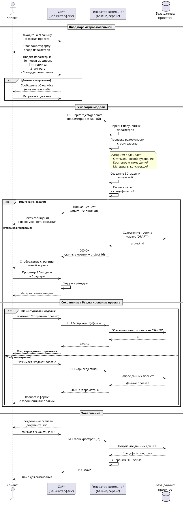

# Пользовательские сценарии

Диаграмма показывает как заказчик генерирует проект котельной в генераторе

```plantuml
@startuml
skinparam sequenceMessageAlign center
skinparam participantPadding 20
skinparam boxPadding 10

actor "Клиент" as Client
participant "Сайт\n(Веб-интерфейс)" as Website
participant "Генератор котельной\n(Бэкенд-сервис)" as Generator
database "База данных\nпроектов" as DB

== Ввод параметров котельной ==
Client -> Website: Заходит на страницу\nсоздания проекта
Website --> Client: Отображает форму\nввода параметров

Client -> Website: Вводит параметры:\n- Тепловая мощность\n- Тип топлива\n- Этажность\n- Площадь помещения

alt Данные некорректны
Website --> Client: Сообщение об ошибке\n(подсветка полей)
Client -> Website: Исправляет данные
end

== Генерация модели ==
Website -> Generator: POST /api/project/generate\n(параметры котельной)
activate Generator

Generator -> Generator: Парсинг полученных\nпараметров
Generator -> Generator: Проверка возможности\nстроительства

note right of Generator
Алгоритм подбирает:
- Оптимальное оборудование
- Компоновку помещений
- Материалы конструкций
end note

Generator -> Generator: Создание 3D-модели\nкотельной
Generator -> Generator: Расчет сметы\nи спецификаций

alt Ошибка генерации
Generator --> Website: 400 Bad Request\n(описание ошибки)
Website --> Client: Показ сообщения\nо невозможности создания
else Успешная генерация
Generator -> DB: Сохранение проекта\n(статус "DRAFT")
DB --> Generator: project_id
Generator --> Website: 200 OK\n(данные модели + project_id)
deactivate Generator

Website --> Client: Отображение страницы\nготовой модели
Client -> Website: Просмотр 3D-модели\nв браузере
Website -> Website: Загрузка рендера
Website --> Client: Интерактивная модель

== Сохранение / Редактирование проекта ==
alt Клиент доволен моделью
Client -> Website: Нажимает "Сохранить проект"
Website -> Generator: PUT /api/project/{id}/save
activate Generator
Generator -> DB: Обновить статус проекта на "SAVED"
DB --> Generator: OK
Generator --> Website: 200 OK
deactivate Generator
Website --> Client: Подтверждение сохранения
else Требуются правки
Client -> Website: Нажимает "Редактировать"
Website -> Generator: GET /api/project/{id}
activate Generator
Generator -> DB: Запрос данных проекта
DB --> Generator: Данные проекта
Generator --> Website: 200 OK (параметры)
deactivate Generator
Website --> Client: Возврат к форме\nс заполненными полями
end
end

== Завершение ==
Website --> Client: Предложение скачать\nдокументацию
Client -> Website: Нажимает "Скачать PDF"
Website -> Generator: GET /api/export/pdf/{id}
activate Generator
Generator -> DB: Получение данных для PDF
DB --> Generator: Спецификации, план
Generator -> Generator: Генерация PDF-файла
Generator --> Website: PDF-файл
deactivate Generator
Website --> Client: Файл для скачивания

@enduml
```